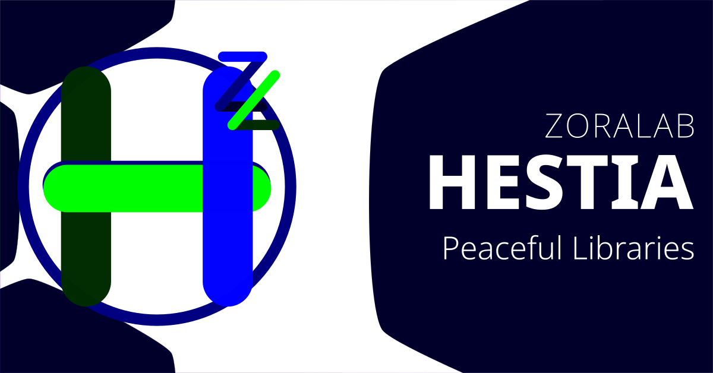

# ZORALab's Hestia


Hestia focuses on uniting software library under a same family pattern to allow
its user to have a peaceful development experiences. The goal is to structure
the learning experience align to a single pattern and deployment, allowing
anyone with different languages and understanding to shine at his/her own way
without worrying about stability.

Visit its [Official Website](https://hestia.zoralab.com) for its official
documentations.


## Installation
To install, please follow this official guide:
https://hestia.zoralab.com/en/versions/


## Licenses
The official license documents are made available at:
https://hestia.zoralab.com/en/licenses/

In summary:
1. All codes - <b>OSI compliant Apache 2.0 License</b>
2. Media (Images, audio, etc) - <b>restricted License</b>


## Code of Conduct
The official code of conduct documents are made available at:
https://hestia.zoralab.com/en/internals/code-of-conduct/

In summary: it's <b>contributor covernant version 2.1 adopted</b>


## Offline Environment Setup
In case you're operating offline or disconnected locations but you still
have Hestia git repository and `hugo` with you, you can also setup the
documentation server locally on your system.

Simply have `hugo` available at your terminal command and at the root
repository directory, issue (command shown here is Linux OS):

```
./.configs/hugo/server.cmd
```

Then visit the presented `localhost` website to read the documentations
(default is http://localhost:8080).
