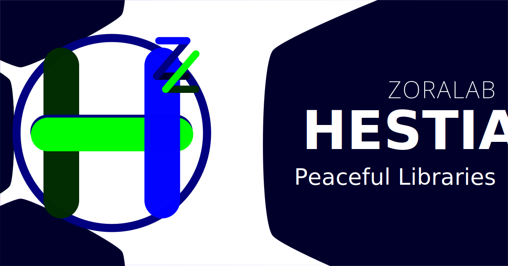

# ZORALab's Hestia

One peaceful libraries suite for building infinite possibilities.

The goal is to unify all common libraries into a single repository for reusable
data structure, smoother the learning experience, and tools alignments. Develop
and learn easily with less worries about supply chain threats and problems.

Visit its [Official Website](https://hestia.zoralab.com) for its official
documentations.

## Getting Started
To install, please follow this official guide:
https://hestia.zoralab.com/getting-started

## Licenses
The official license documents are made available at:
https://hestia.zoralab.com/licenses

Summary:
1. Codes - <b>OSI compliant Apache 2.0 License</b>
2. Media (Images, audio, etc) - <b>restricted License</b>

## Offline Environment Setup
**COMING SOON**.
