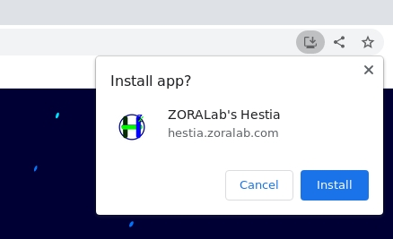
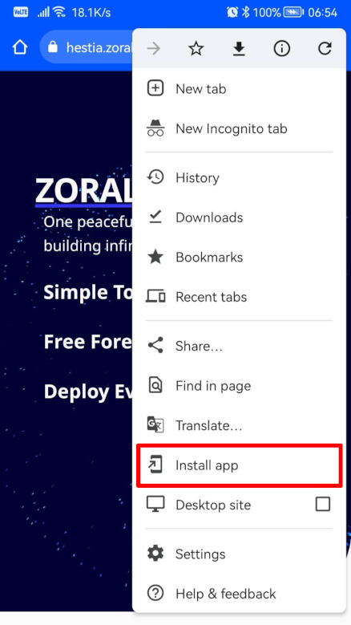

# ZORALab's Hestia

Frontend+Backend in One Peaceful Suite; by Developers; for Developers.

The project is to unify all common libraries and data structure into 1 single
repository for highest attributes of reusablity, smoother learning curves, and a
more wholesome tools alignments. Develop and learn advanced products easily with
less worries about supply chain problems.

Visit the [Official Website](https://hestia.zoralab.com) for its documentations,
getting started guides, and etc.

## Offline Documentation
The existing offical website containing the coding documentation are offline
capable by default. All you need to do is to install it as a PWA app and visit
the pages you need while online within the app:

### Desktop Prompt

### Android Based Mobile Prompt

## Licenses
The official license documents are made available at:
https://hestia.zoralab.com/licenses

Summary:
1. Codes - <b>OSI compliant Apache 2.0 License</b>
2. Media (Images, audio, etc) - <b>restricted License</b>
