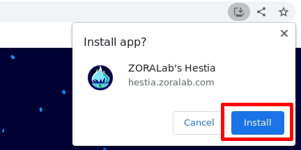

# ZORALab's Hestia

One Peaceful Frontend+Backend Library Suite; by Developers, for Developers.

The project is to unify all common libraries and data structure into 1 single
repository for highest attributes of reusablity, smoother learning curves, and a
more wholesome tools alignments. Develop and learn advanced products easily with
less worries about supply chain problems.

Visit the [Official Website](https://hestia.zoralab.com) for its documentations,
getting started guides, and etc.

## Why It Matters
This project was initiated primarily because of:

1. **Resolve supply chain threats** caused by geo-political nuisance, dirty
   after the fact shenanigans, or cut-throat charges.
2. **Simple to integrate** with a simple `zip` archive format + its GPG
   cryptography signature for integrity checking.
3. **Deploy everywhere** from servers to microcontrollers where anything that
   can compute.

## License
The project is licensed under multiple licenses depending on the content you're
using. Please visit the
[Official License Page](https://hestia.zoralab.com/licenses) for detailed info.
In summary:

1. Codes — [OSI compliant Apache 2.0](https://opensource.org/license/apache-2-0/)
2. Media (Image, audio, etc) — `Restricted License`. Go source from the artists
   directly.

## Offline Documentation
The existing offical website containing the coding documentation are offline
capable by default. All you need to do is to install it as a PWA app and visit
the pages you need while online within the app:

### Desktop Prompt

### Android Based Mobile Prompt

## Roadmaps
This project is a huge and ambitious. It aims to be inter-operable between
**Hugo**, **Go**, **TinyGo**, and **Nim** covering outputs like `Backend`,
`Frontend UI`, `PWA`, `WASM`, and `Embedded` (microcontrollers). We divided the
tasks into phases viewable in our
[GitHub Project](https://github.com/orgs/ZORALab/projects/6).

### ☑️ Initialization Phase 1 - PWA+WASM Content Servers
Capable of:

1. Build a PWA static website natively and seamlessly as basic requirements.
2. Resolve most of the web technologies related shortfalls like precise content
   compilations, portable offline capable HTML, CSS basics, CSS variables
   compilations, favicon generators, and JS compilations.
3. Able to seamlessly initialize and execute WASM natively either using
   single page application (SPA) approach or reactive rendering approach
   ('react-like').
4. Permits all kinds of web developers to develop their web content like
   `HTML only`, `HTML+CSS only`, `HTML+JS only`, and `HTML+CSS+JS only`.
5. Maintainable, scalable, and upgradable.

* Key technologies: [Hugo](https://gohugo.io/)

STATUS: **[COMPLETED] Febuary 9, 2023; `v1.X.X`**

### ⚙️ Initialization Phase 2 - Pure WASM Frontend Takesover
Capable of:

1. Building the entire page or application (frontend UI) using `Go`, `TinyGo`,
   and `Nim` backend-oriented programming languages into a WASM binary output.
2. Seamlessly fed into the content servers and operate natively without external
   interventions.
3. Permits UI development capability.
4. Backward-compatible for non-WASM users.

* Key technologies: [Hugo](https://gohugo.io/), [Go](https://go.dev/),
  [TinyGo](https://tinygo.org/), and [Nim](https://nim-lang.org/).

STATUS: **[WORKING] to-date; `v2.X.X`**

### 🔖 Initialization Phase 3 - Microcontrollers
Capable of:

1. Libraries can be used on (8/16/32) microcontrollers ELF and binaries natively
   using `TinyGo` and `Nim` backend programming languages.
2. Optimized libraries for small footprints.
3. Enhances CI automations for reproducible builds.

* Key technologies: [TinyGo](https://tinygo.org/), and
  [Nim](https://nim-lang.org/).

STATUS: **[PLANNED] to-date; `v3.X.X`**

### 🔖 Initialization Phase 4 - Wrap Up Initialization
Capable of:

1. Stabilized libraries for new feature and future development adds-on.
2. Clean up all existing initialization projects' bugs and tickets.
3. Plans for expanding libraries to hot-topics like artificial intelligence and
   augmented reality.

* Key technologies: [Hugo](https://gohugo.io/), [Go](https://go.dev/),
  [TinyGo](https://tinygo.org/), and [Nim](https://nim-lang.org/).

STATUS: **[PLANNED] to-date; `v4.X.X`**
